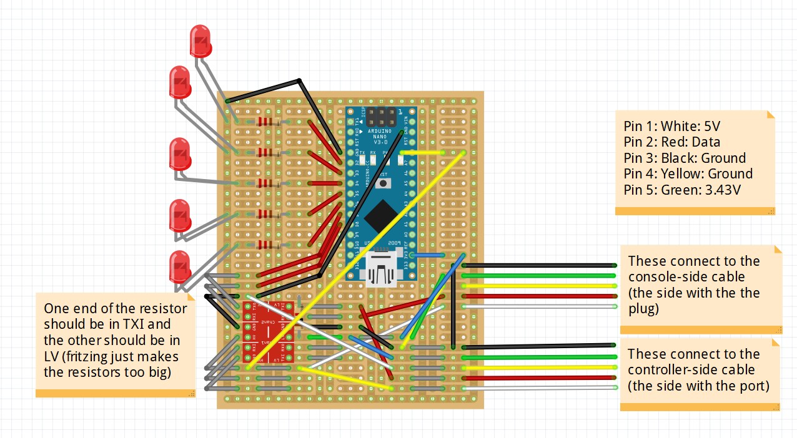

# GCC-External-Macros
Wiring diagram for an external Arduino setup for a GameCube controller, along with code to read inputs from the controller and map them to macros to send to the console.

This is mainly targeted at Super Smash Bros Melee, and performing humanly impossible actions, but the hardware setups can be used for any situation where you'd want to read input from the controller, access or modify it, and send outputs to the console.

This is very much a work in progress, and the supplied code is nowhere near being fully functional (it's mostly just a proof-of-concept as of now).

-----------------------------------

## External Arduino Setup
(Plug the controller into one end, and plug the other end into the console)

[Link to the Fritzing wiring diagram](external_diagram.fzz)

-----------------------------------

## Internal Arduino Setup
(Wire the arduino directly to the controller, and fit the arduino inside the controller)

-----------------------------------

## About the Code
[Link to the code](controller_mod.ino)

The current code simply reads inputs from the controller and outputs them to the console, with the exception of a few macro'd bindings. When holding the right trigger, pressing and holding B will run a macro to perform frame-perfect multishines on Fox in Super Smash Bros Melee.

-----------------------------------

## More info, credits, etc

The code makes large use of NicoHood's Nintendo library, which can be found [here](https://github.com/NicoHood/Nintendo). (Definitely check if out if you want more examples of how to read/write to/from a gamecube or gamecube controller.
The wiring is also largely inspired by his work.
